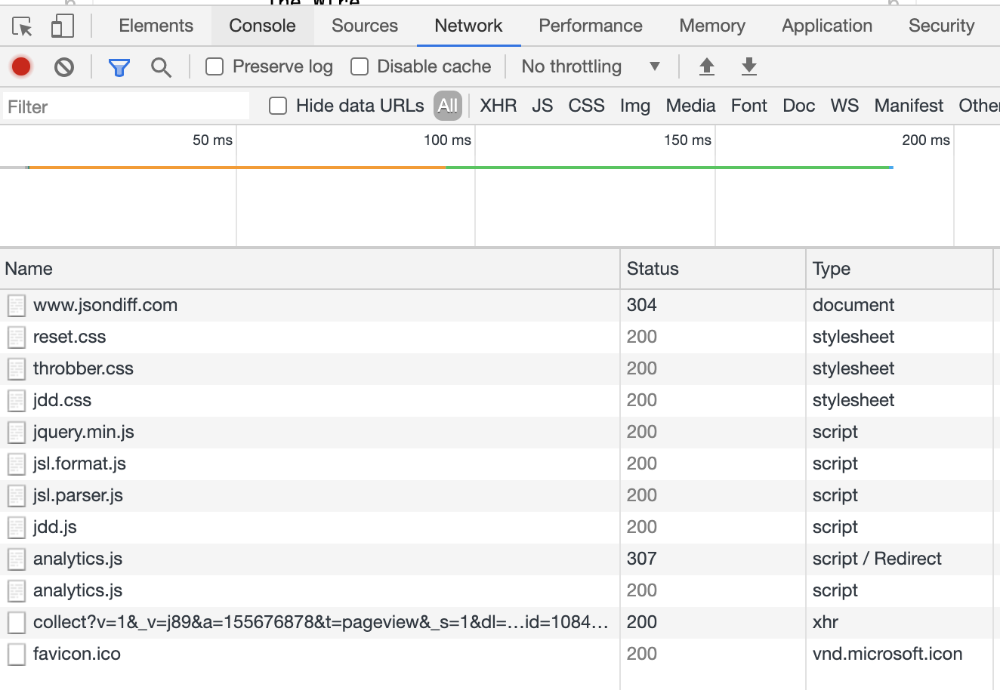

JSON Diff
==================================================

JSON Diff expands on the amazing work by the team at [jsonlint.com](http://www.jsonlint.com) and provides a semantic compare tool for JSON documents.

I often work with large documents and it's difficult to see the differences between them.  Normal text compare tools work well for finding the differences in JavaScript code, but JSON data can have many differences in the text that don't actually change the data.  

JSON Diff sorts, formats, and compares two JSON documents to find the actual semantic differences instead of just the text ones.

Try it out:  [http://www.jsondiff.com](http://www.jsondiff.com)

Run the built-in unit tests:  [http://www.jsondiff.com/index-test.html](http://www.jsondiff.com/index-test.html)


## Run JSONDiff in a Docker container

You can also run JSONDiff in a Docker container if you want to run it in your data center or just on your laptop.  First [install Docker](https://docs.docker.com/get-docker/) and then open a terminal the run the following command:

```
docker run -d --name jdd --rm -p 8080:80 zgrossbart/jsondiff
```

Now go to [localhost:8080](http://localhost:8080) to access your locally running version of JSONDiff.

You can stop the container with this command:

```
docker stop jdd
```

You can also build the Docker file locally and run it with these commands:

```
docker build --tag=jdd:v1-alpine --file=Dockerfile.alpine .
docker run -i --name jdd -p 127.0.0.1:8080:80/tcp jdd:v1-alpine
```


## Load my JSON data from the Internet

JSONDiff also supports two query paramaters so you can load your JSON data from the Internet instead of having to enter it into the UI.  

| Parameter | Description |
| --- | --- |
| `left` | An URL to the file to compare on the left side of the diff |
| `right` | An URL to the file to compare on the right side of the diff |

These parameters work like this:

```
https://jsondiff.com/?left=https://jsondiff.com/one.json&right=https://jsondiff.com/two.json
```

Each parameter must be a full URL and must be publicly accessible over the Internet.

## Load my JSON data in the URL

JSONDiff can use the two query parameters to load data embedded in the URL.  

| Parameter | Description |
| --- | --- |
| `left` | A [base64 data URL](https://developer.mozilla.org/docs/web/http/basics_of_http/data_urls) that contains the JSON to be compared on the left side of the diff |
| `right` | A [base64 data URL](https://developer.mozilla.org/docs/web/http/basics_of_http/data_urls) that contains the JSON to be compared on the right side of the diff |

These parameters work like this:

```
https://jsondiff.com/?left=data:base64,eyJmb28iOiAxfQ==&right=data:base64,eyJmb28iOiAyfQ==
```

You can encode JSON data using these parameters to easily send or save two documents to compare.

There are various tools you can use to base64 a JSON file including the command line and websites.

## Load my JSON data via URL hash

JSONDiff also accepts the query parameters to be passed as [hash properties](https://developer.mozilla.org/docs/web/api/URL/hash) like this:

```
https://jsondiff.com/#left=data:base64,eyJmb28iOiAxfQ==&right=data:base64,eyJmb28iOiAyfQ==
```

This option works well for larger JSON files which are too large for the previous method using URL parameters.

## How large a file can JSONDiff handle?

JSONDiff does all of the comparing and rendering right in your browser.  That means it's limited by the browser your running (Chrome is normally the fastest), how fast your computer is, and how much memory you have.  However, it can handle a very large file.

We have two sample files from the Pokemon Go API describing the Pokemon Charmander: `charmander_left.json` and `charmander_right.json`.  Each of these files are over 240 kb and almost 13,000 lines when formatted.  You can load and compare them with a single URL:

[https://jsondiff.com/?left=https://jsondiff.com/charmander_left.json&right=https://jsondiff.com/charmander_right.json](https://jsondiff.com/?left=https://jsondiff.com/charmander_left.json&right=https://jsondiff.com/charmander_right.json)

Thanks to some recent performance improvements from [@Pluckerpluck](https://www.github.com/Pluckerpluck) you can now compare the two in just a few seconds.  Click the URL above and try it out for yourself.

## Is JSONDiff Secure?

You might notice that [http://www.jsondiff.com](http://www.jsondiff.com) doesn't run with HTTPS and ask, is JSONDiff secure?  The short answer is yes, but you shouldn't take my word for it.  

JSONDiff does all of the comparing in the browser.  It never sends any of your JSON data anywhere and you can run a little experiment to prove it.  

Open the developer tools in your browser and select the Network tab.  You'll see all of the requests your browser sends.  It looks like this:



Now do a JSON compare with some sample data and watch the requests.  There will be no new requests.  That shows that we don't send your data anywhere.

### What data does JSONDiff load?

JSONDiff loads the following files when it first starts up:

| File | Description |
| --- | --- |
| `jsondiff.com` | The main index page for the site |
| `adsbygoogle.js` | We load ads from Google |
| `reset.css` | The reset CSS file |
| `throbber.css` | A CSS loading icon |
| `jdd.css` | The CSS file for JSONDiff |
| `jsl.format.js` and `jsl.parser.js` | The JSON formatter and parser that JSONDiff uses when doing a compare |
| `jdd.js` | The code that runs JSONDiff |
| `analytics.js` | Google Analytics that we use to see how many people are using JSONDiff.com |
| `collect` | Google analytics loads these scripts for analytic data |
| `js` | This is [gtag](https://developers.google.com/tag-platform/gtagjs) support for analytics |
| `favicon.ico` | The JSONDiff icon that shows up in the tab of your browser |

JSONDiff will never load any more files.  

### What data does JSONDiff send back over the Internet?

It sends nothing.  It just loads the open source files it needs to run and never sends any of the JSON data it is comparing anywhere.

### All the security details

This readme file just gives the high level details of the security of JSONDiff.  Check out our [threat model](threat_model) for all of the details about the security of JSONDiff.

### Why does JSONDiff use HTTPS?

Given the fact we don't send any data over the Internet you might ask why we're using HTTPS.  We don't have any data to encrypt.  

HTTPS provides encryption of the data, but it also provides verification of the identity of the site.  HTTPS guarantees that we are who we say we are and you aren't getting a man in the middle attack where a different site is pretending to be JSONDiff.com.

### That still doesn't feel secure enough

If that still doesn't feel secure enough you have some other options.  It's very easy to host JSONDiff for yourself.  You can either run in a Docker container, or run on any web server that supports PHP.  You can even skip the PHP part if you don't want to support loading JSON automatically.  Just drop the JSONDiff files in your web server directory and you're done.

## Monitoring

JSONDiff has a separate monitoring page.  You can see the current status at the [JSONDiff Upptime page](https://zgrossbart.github.io/jdd-upptime/).
