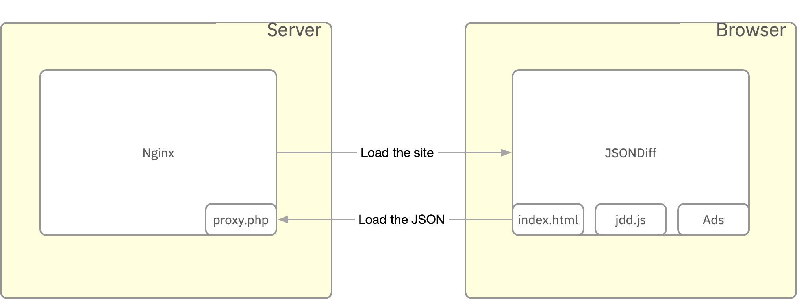

# JSONDiff Threat Model

This document is the threat model for JSONDiff. This covers the software running at [jsondiff.com](https://www.jsondiff.com/) as well as the open source project which can be hosted on other platforms.

## Architecture

JSONDiff compares two JSON documents and shows the differences.  JSONDiff finds the semantic differences in the JSON documents instead of finding the syntactic differences like a text editor or standard `diff` tool.  For example, JSONDiff will find two object properties with different values independent of the order of those properties in the object.

JSONDiff is hosted at [www.jsondiff.com](https://www.jsondiff.com/).  Copies of JSONDiff are also hosted by third-parties for internal use.  This threat model only covers the instance hosted at www.jsondiff.com.

JSONDiff is a one page JavaScript application running in a browser. It doesn't communicate externally, have any data storage, or contain any personal information of any kind. It also doesn't manage credentials or perform any kind of authentication or authorization.

More information about what data JSONDiff loads while comparing JSON files is available in the [JSONDiff Readme file](../#is-jsondiff-secure).



JSON diff loads two JSON files, parses them using a custom parser, and compares the results. The differences are then loaded in the current page and displayed. Users may navigate through the differences to view them.

There are three ways to provide files for JSON diff to compare:

1. Copy and paste the contents of the file into the text area in the browser
2. Use the file browser to select a file from the local file system
3. Profile an URL to the file using the `left` and `right` URL parameters

### `proxy.php`

JSONDiff is almost entirely a browser-based application and can be run with any simple HTTP file server or from a local file system. The one exception is the `proxy.php` file.

This file acts as a simple proxy server to allow JSONDiff to load JSON files from other locations on the Internet. You can use this project by accessing JSONDiff with an URL like this:

```
https://jsondiff.com/?left=https://jsondiff.com/one.json&right=https://jsondiff.com/two.json
```

This will cause the `proxy.php` service to load the two files specified with the `left` and `right` URL parameters.

### Dependencies

JSONDiff has the following external dependencies:

#### Runtime

* [Google Analytics](https://analytics.google.com/analytics/web/)
* [Google AdSense](https://adsense.google.com/)

#### Test time

* [qUnit](https://qunitjs.com/)

All of these dependencies are currently hard-coded. There is no build process for JSONDiff.

### Deployment

JSONDiff can be deployed to any HTTP server with the ability to serve static files. It can also be hosted in any container. A server capable of running PHP is required if you want to support the extra functionality of the `proxy.php` file, but isn't required for any other functionality.

JSONDiff is currently hosted on the Grid Hosting service offered by [MediaTemple](https://mediatemple.net/).

Deployment is handled by connecting to a file server via sFTP and uploading the new version. Deployments are currently manual.

JSONDiff also provides two sample Docker files (one for Ubuntu and one for Alpine images). They are provided as samples and are not used in the deployment of www.jsondiff.com.

### Testing

JSONDiff has a full set of functional tests powered by the [qUnit](https://qunitjs.com/) framework. These tests can be accessed and run on the [index-test.html](https://www.jsondiff.com/index-test.html) page. Accessing this page will execute a live set of tests every time the page is loaded. Reloading the page will rerun the tests.

These tests cover the basic functionality of the JSONDiff tool, the functionality of the `proxy.php` service, and other edge cases. Whenever a bug is found and fixed in JSONDiff a corresponding test case is added.

### Monitoring

JSONDiff is monitored with the [JSONDiff Upptime](https://zgrossbart.github.io/jdd-upptime/) project. This project provides monitoring of the deployment at JSONDiff.com. When errors are detected an issue is generated and the site administrators are notified via email.

All monitoring data is public and a sample of one these issues is available here:  [#194](https://github.com/zgrossbart/jdd-upptime/issues/194). Most issues are automatically resolved when service is restored.

## Threats

JSONDiff is a static application with no data storage. That means large threat areas don't apply to the application.

When using JSONDiff you're trusting three parties:

* [Zack Grossbart](https://github.com/zgrossbart) - Zack manages the code and the deployments of JSONDiff. All source code and processes are open source and can be inspected by anyone.
* [Google AdSense](https://adsense.google.com/) - The ad service made available by Google.

### Threats to data

JSONDiff doesn't load or store any data as any part of operation. As a result it doesn't supply encryption in transit or encryption at rest because there's no data to encrypt.

JSONDiff has no possibility for SQL injection or other database injection attacks because it has no data stores.

The `proxy.php` service will load data from other sites, but that service has no special access and can only load data that is already publicly available on the Internet. This service will load data encrypted with SSL if the location of that data is specified to use SSL.

All data served by the `proxy.php` file is encrypted with SSL.

### Privilege escalation threats

JSONDiff doesn't perform any authentication or authorization. That means there are no escalated privileges and therefore no opportunities for privilege escalations.

### Coding threats

JSONDiff uses a protected main branch and requires pull requests when merging code. Those pull requests do not require multiple reviewers since there is only one committer on the project.

#### Threats

1. The code for JSONDiff is not peer reviewed before merging into the main branch. This threat is mitigated by making all source code for JSONDiff open source and available for inspection by any third-party.
2. JSONDiff doesn't contain any static code analysis as part of the build process. This threat is mitigated by the manual use of [JSHint](https://jshint.com/).

### Dynamic scanning

JSONDiff uses static code analysis, but does not perform any dynamic scanning. JSONDiff doesn't provide any servers or server configuration. There's nothing to dynamically scan.

### Separation of duties

JSONDiff is accepts pull requests from the general public with a single committer. This model doesn't allow separation of duties. A single person owns the whole process of code creation, review, testing, and deployment.

This threat is mitigated by having the entire project as open source. All code and processes may be reviewed by all third parties.

### Third-party threats

JSONDiff has only three external dependencies and doesn't use any code scanning for those threats.

#### Threats
1. JSONDiff doesn't provide an [SBOM](https://en.wikipedia.org/wiki/Software_supply_chain) file. This risk is mitigated by the very small number of dependencies used by JSONDiff.
2. Google AdSense and Google Analytics could introduce malicious code. There's no good mitigation for this threat. JSONDiff just trusts those two Google projects. Google has their own process for threat modeling for those projects, but they must be loaded live and communicate back to Google for proper functionality.

### Client-side threats

JSONDiff is a client-side application and must consider client threats. Most client-side threats are not applicable given then very limited functionality of JSONDiff.

#### CSRF and CSS attacks

JSONDiff does not have any forms or submit any data, but it still has some potential vulnerability to [CSRF and CSS attacks](https://owasp.org/www-community/attacks/csrf). The main vector for those threats comes from the `proxy.php` file which can load potentially malicious files. Those files can be loaded via an URL and someone could be tricked into accessing that URL.

JSONDiff mitigates this threat by ensuring that no files loaded from the `proxy.php` mechanism are ever executed. These files are only ever parsed using a custom JSON parser. 

This can be verified with the following URL:

```
https://jsondiff.com/?left=https://jsondiff.com/evil.js&right=https://jsondiff.com/evil.json
```

### Stability, outages, and BCDR

JSONDiff uses functional tests to ensure stability. High availability is provided by the service provider Media Temple. 

The business continuity and datacenter recovery plan for JSONDiff is very simple. If a major outage occurs the service can be restored on any HTTP server that supports static files.

The [JDDUpptime](https://github.com/zgrossbart/jdd-upptime) project monitors JSONDiff.com for outages.

### Deployment

JSONDiff deploys through sFTP to a file server.

#### Threats

1. If a malicious actor had the credentials they could attempt to access the sFTP site and upload malicious code to JSONDiff.com. This threat is mitigated by IP address source verification. All sFTP connections are verified by IP source address. All sFTP connections from a new source address require manual approval before the connection is granted.
2. The sFTP user uses separate credentials from the main account and has only limited access. The sFTP user can not approve any new source addresses.

### Personal Identifiable Information

JSONDiff doesn't store any personal or identifying information since it doesn't store any data. Comparing JSON data with personal or identifying information is safe because the data is never sent to any other sources and never leaves the browser memory.

### Credential management

JSONDiff.com has no credentials to manage. There are no upgraded privileges and no way to log into the application.

The deployment uses two sets of credentials:

1. sFTP credential
2. Main account credential

The sFTP credentials are addressed above in the deployment section. The main account credentials are managed by the single main account owner. If those credentials are compromised then the service provider (Media Temple) will alert the main account holder to do account recovery. This process is protected by [multi-factor authentication](https://en.wikipedia.org/wiki/Multi-factor_authentication).

### Operating Systems

JSONDiff.com doesn't contain any operating system deployments. It doesn't rely on any containers, pods, or virtual machines. As such it has no system level package scanning since it has not system level package dependencies.

